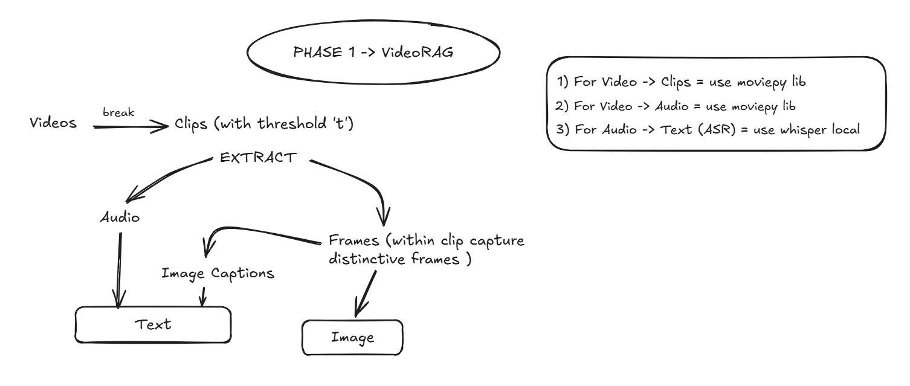
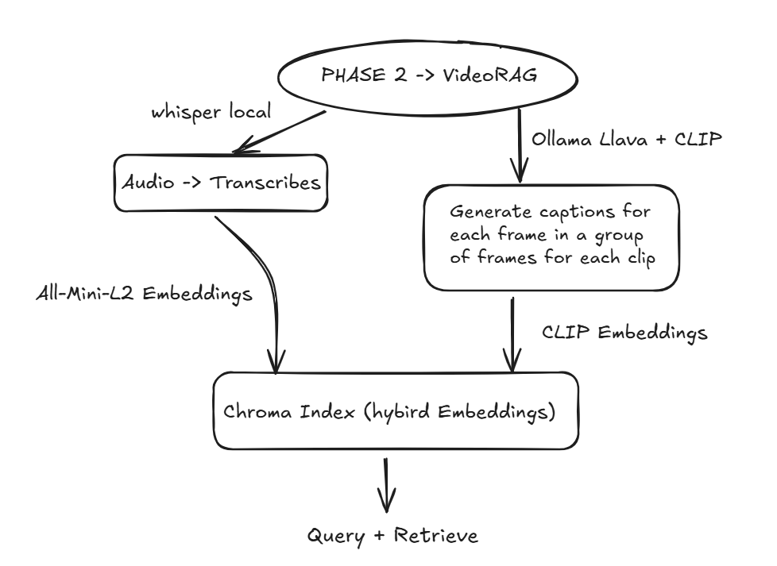

# VIDEO RAG
Video based Question and Answering with Video Transcriptions + Frame coverage. 

## Demo

## HIGH LEVEL ARCHITECTURE 
### OVERVIEW
The system generates transcriptions and extracts key video frames, converts them into embeddings, and stores everything in a vector database. During a query, the RAG pipeline retrieves the most relevant transcript chunks and frames to give accurate, grounded answers.Each chunk is stored with metadata like timestamps and frame IDs, allowing the system to also point you to the exact part of the video where the answer appears, along with approximate timing.

## Tech Stack
Python, FastAPI (optional)
Whisper ASR Local LLM
CLIP for frame embeddings
Chroma for vector search
FFmpeg / MoviePy for video processing

## Results
**Accurate retrieval for both visual and verbal content
**Effective contextual QnA on long-form videos
**Validated VideoRAG pipeline for enterprise use cases: Training videos, CCTV reasoning, Meeting recordings datasets.

© 2025 Shree Sudame. All rights reserved.
This repository showcases the conceptual workflow, architecture, and demonstration of the project for portfolio purposes.
The underlying source code, internal scripts, datasets, and configurations are not included due to confidentiality agreements and organizational policies.
Unauthorized use, reproduction, or distribution of the materials in this repository is strictly prohibited.
